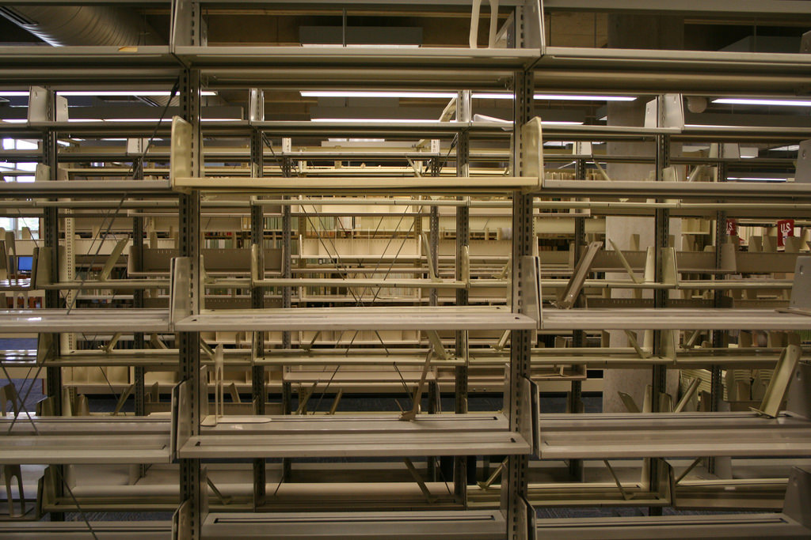

# Shelving (née Tupelov)


> Shelving; Noun;
>
> Collective form of Shelf; a thin slab of wood, metal, etc., fixed horizontally to a wall or in a
> frame, for supporting objects.

Before you can have [Stacks](https://github.com/arrdem/stacks), you need shelving for the books.

## Manifesto

There's already plenty of prior art in the Clojure ecosystem for in-memory databases.
[datascript][datascript], [pldb][pldb] and [intension][intension] pop to mind, among others.
These tools optimize for database-like query access over in-memory structures and don't provide concrete serialization stories.

For small applications which just need an initial persistence system, or applications which want to distribute data as resources, traditional databases which require a central available server are a poor fit.

Shelving is a tool set for trying to implement quick-and-dirty storage layers for your existing [clojure.spec(.alpha)][spec]'d data while retaining some of the query niceties that make ORMs and real databases compelling.

# Overview

Shelving leverages the same basic insight behind Alan Dipert's [intension][intension], that is a mapping such as

```clj
{:foo 1
 :bar 2
 :baz 3}
```

is actually a set of ordered pairs

```clj
#{[:foo 1]
  [:bar 2]
  [:baz 3]}
```

In [Datalog][datalog] and other logic database systems, facts such as `aunt(Julie, Reid)` can be represented as tuples `("Julie" :aunt "Reid")`.
If we give an identifier to a map, such as a `UUID` or a [content hash](https://github.com/replikativ/hasch), we could model the same map above as:

```clj
#{[id :foo 1]
  [id :bar 2]
  [id :baz 3]}
```

the advantage of which is that, so long as `id` is unique to the original source mapping, we can easily talk about queries through arbitrarily nested structures.

Unfortunately the idea of `(${ID} ${REL} ${ID})` is less than ideal.
Particularly, it fails to communicate the idea of what we're relating to what - type information if you will or at least semantic context for the relation.

The key idea behind shelving is that `clojure.spec(.alpha)` gives us an interesting alternative to talking about the key structure - we can leverage specs to think about structures and their relations.
To re-visit the same example yet again, we could use `clojure.spec` to describe the structure as such -

```clj
(require '[clojure.spec.alpha :as s])

(s/def ::foo pos-int?)

(s/def ::bar pos-int?)

(s/def ::baz pos-int?)

(s/def ::example
  (s/keys :req-un [::foo ::bar ::baz]))
```

which enables us to consider the set of tuples as relating from the spec `::example` to some other spec particularly.
This allows us to preserve spec (type) information in our relations by considering relations to be from one spec to another.
So our map example above could be encoded as

```clj
#{[id [::example ::foo] 1]
  [id [::example ::bar] 2]
  [id [::example ::baz] 3]}
```

Just like [intension][intension], we can use Datalog to query over these tuples, the relations are just tuples now.
Say we had a bunch of `::example` structures in a connection of some sort, we could use Datalog to say select all the `::foo`s

```clj
(require '[shelving.query :refer [q]])

(def q-fn
  "Produces a function of a connection and here 0 query parameters
  which executes the query producing a sequence of results."
  (q *conn*
      '[:find [[?foo ::foo]]]))

(q-fn *conn*)
;; => ({?foo 1}
;;     {?foo 2}
;;     ...}
```

But this presumes that we have a `*conn*` which we can read and query from.
How do we get there?

### Schemas

Before we can begin to read or write from a shelving store, we need to at least set up a sketch of what it is we'll be reading and writing.
Shelving, like SQL stores, has a notion of a schema.

Schemas serve two purposes - to enumerate the `clojure.spec(.alpha)` structures which we expect to be able to serialize and deserialize, how they relate to each-other, and how we want to respond when serializing un-declared schemas and relations.

A spec may be entered into a schema either as a "value" or a "record".
[`#'shelving.core/value-spec`](/docs/schema.md#shelvingcorevalue-spec) enters a new spec into a schema, producing a new schema which will treat values of that spec as well values - that is they can be written once, read forever and updated never.
[`#'shelving.core/record-spec`](/docs/schema.md#shelvingcorerecord-spec) is similar in that it enters a new spec into the schema, but record specs have update-in-place semantics.
They need not remain constant for all time.

Schemas also describe the ways that specs relate to each other.
[`#'shelving.core/spec-rel`](/docs/schema.md#shelvingcorespec-rel) enables us to update the schema by stating that we'll allow elements of one spec relate to those of another.
In our example after all, we want to be able to relate `::example` to all of `::foo`, `::bar` and `::baz`.

So lets set up our shelf.

```clj
(require '[shelving.core :as sh])

(def *schema
  (-> sh/empty-schema
      (sh/value-spec ::foo)
      (sh/value-spec ::bar)
      (sh/value-spec ::baz)
      (sh/value-spec ::example)
      (sh/spec-rel [::example ::foo])
      (sh/spec-rel [::example ::bar])
      (sh/spec-rel [::example ::baz])))
```

While we can manually enumerate all the specs we want to use in our schema, doing so becomes tiresome.
In fact, it isn't possible if we want to be able to leverage multi-specs.

Schemas are immutable, but shelving stores support live schema extension.
We can configure our schema to allow for dynamic extension both to new specs and to new records.
[`#'shelving.core/automatic-specs`](/docs/schema.md#shelvingcoreautomatic-specs) and [`#'shelving.core/automatic-rels`](/docs/schema.md#shelvingcoreautomatic-rels) respectively direct Shelving to automatically perform a schema migration to add a spec or a rel when it is encountered the first time.

### Writing

Now that we've got our schema, we can connect to a store of one sort or another for reading and writing.
As of this writing, Shelving ships with a pair of simple, inefficient stores intended mainly to demonstrate that yes the query engine and persistence machinery works.

The `shelving.log-shelf` namespace provides a Shelving store implemented using an in-memory append-only write log with no compaction which serializes to EDN.
It's completely inappropriate for most use cases because almost every operation is a scan but dead easy to get right for development and simple to understand.

The `shelving.map-shelf` namespace provides a Shelving store implemented using a very PLDB style magic maps / full indexing model.
This store is actually pretty efficient when querying, but is fully in-memory.

The hope is that the Shelving store interface is generic enough that more serious storage layers atop Redis, RocksDB and Nippy can be developed separately.

For the same of the demo, we'll use the append only log store.

```clj
(require '[shelving.log-shelf :refer [->LogShelf]])

(def *cfg
  (->LogShelf *schema "target/demo.edn"))

(def *conn
  (sh/open *cfg))

(sh/put-spec *conn ::example {:foo 1, :bar 2, :baz 3})
;; => #uuid "39bd0d1e-f102-5ac0-a491-d611b075563c"

(sh/flush *conn)
(sh/close *conn)

(def *conn
  (sh/open *cfg))

(sh/get-spec *conn ::example #uuid "39bd0d1e-f102-5ac0-a491-d611b075563c")
;; => {:foo 1, :bar 2, :baz 3}
```

We can take a peek under the hood and see the actual changelog that represents this state if we want to -

```clj
(-> *conn :shelving.log-shelf/state deref reverse)
([:schema
  {:type :shelving.schema/schema,
   :automatic-specs? false,
   :automatic-rels? false,
   :specs {:user/foo {:type :shelving.schema/spec,
                      :record? false,
                      :rels #{[:user/example :user/foo]}},
           :user/bar {:type :shelving.schema/spec,
                      :record? false,
                      :rels #{[:user/example :user/bar]}},
           :user/baz {:type :shelving.schema/spec,
                      :record? false,
                      :rels #{[:user/example :user/baz]}},
           :user/example {:type :shelving.schema/spec,
                          :record? false,
                          :rels #{[:user/example :user/baz]
                                  [:user/example :user/bar]
                                  [:user/example :user/foo]}}},
   :rels {[:user/example :user/baz] {:type :shelving.schema/rel},
          [:user/baz :user/example] {:type :shelving.schema/alias,
                                     :to [:user/example :user/baz]},
          [:user/example :user/bar] {:type :shelving.schema/rel},
          [:user/bar :user/example] {:type :shelving.schema/alias,
                                     :to [:user/example :user/bar]},
          [:user/example :user/foo] {:type :shelving.schema/rel},
          [:user/foo :user/example] {:type :shelving.schema/alias,
                                     :to [:user/example :user/foo]}}}]
 [:user/example
  #uuid "39bd0d1e-f102-5ac0-a491-d611b075563c"
  {:foo 1, :bar 2, :baz 3}]
 [#uuid "39bd0d1e-f102-5ac0-a491-d611b075563c"
  [:user/example :user/baz]
  #uuid "07846747-fad3-5ac5-ab9a-ab6017c47a25"]
 [:user/baz #uuid "07846747-fad3-5ac5-ab9a-ab6017c47a25" 3]
 [#uuid "39bd0d1e-f102-5ac0-a491-d611b075563c"
  [:user/example :user/bar]
  #uuid "340c9ad3-3355-58f1-a504-6584168a3955"]
 [:user/bar #uuid "340c9ad3-3355-58f1-a504-6584168a3955" 2]
 [#uuid "39bd0d1e-f102-5ac0-a491-d611b075563c"
 [:user/example :user/foo]
  #uuid "1b1349bd-d9c2-5f35-a58c-ee0d8495eef1"]
 [:user/foo #uuid "1b1349bd-d9c2-5f35-a58c-ee0d8495eef1" 1])
```

The first element of the changelog is the full schema for the connection.
If we were to perform a schema migration, then a new schema would be appended to the changelog.

Next, we see the write of the value we wanted to store.
Shelving doesn't yet fully decompose values into their substructures.
However, we do see that all the substructures were separately entered, along with tuples forming relations to the original value.

### Querying

Shelving provides an implementation of a what is currently subset of Datalog, which depends only on the basic store API.
This means that queries can be compiled and executed against any complete storage layer - storage layers don't have to implement their own query system.

The structure of Shelving's Datalog is basically the same as that of intension, DataScript or Datomic.
You can read the parser in [`shelving.query.parser`](/src/main/clj/shelving/query/parser.clj) if you want to but in brief it uses `clojure.spec(.alpha)` to conform a map and a vector query coding down to a normal form which can be compiled.

A query must have a `:find` clause, which indicates a series of logic variables to be selected.
Results from the query will be mappings with logic variables as keys and realized database values as values.

Say we wanted to query all our `::foo` values.
We only have one, `1` but just for grins.

We'll use the `q!` function, which both compiles and executes a query, producing results.


```clj
(sh/q! *conn
  '[:find [:from ::foo ?foo]])
;; => ({?foo 1})
```

You may be scratching your head right now at the `:from` structure.
Shelving takes specs (types) seriously.
Unlike other Datalog implementations which play fast and loose with typing and relations, Shelving has to know precisely what spec you're trying to query against and what relations you're intending to leverage when compiling a query.
Don't worry, the query language has type inference (and checking!)
capabilities to save you from having to be completely explicit.

In this query, we said "select all `?foo` where `?foo` is in `::foo`".
We have to specify the spec of `?foo` in `:find` parameter because there's no other information in our query which would let Shelving infer the spec of `?foo`.

If we leave off the spec, we'll get a compilation error telling us that Shelving can't figure out what to do.

```clj
(sh/q! *conn
  '[:find ?foo])
;; ExceptionInfo Unable to resolve non-hole spec for lvar '?foo'!  clojure.core/ex-info (core.clj:4739)
```

As with traditional Datalog, there are no rules restricting what you can select.
Selects can be from the same spec or multiple specs.

Shelving supports late parameterization of queries.
Lets say we wanted to relate `::foo` to `::bar`.
We can do so by joining `::foo` to `::bar` pivoting off of their common relation to `::example`.
What if we wanted to find all the `::bars` which relate through `::example` to a `::foo` with some value?

We can use the `:in` clause to specify a sequence of logic variables (either type inferred or with `:from` blocks) which will be compiled to query parameters.
At present, only scalar query parameters are supported.
We'll use the `q` function, which just compiles the query but doesn't execute it yet, and the `:where` clause to enumerate relations between our logic variables.

```clj
(sh/q *conn
  '[:find ?bar
    :in ?foo
    :where [[?e [::example ::bar] ?bar]
            [?e [::example ::foo] ?foo]]])
;; => #object[...]
```

Okay so we got an opaque function instance thing back.

Compiled Shelving queries are functions of a connection, plus logic variable bindings in the order that they occurred in the `:in` clause.
So here, our query function is going to be a function `(f *conn ?foo) => ...` so lets apply it.
Our only `::foo` is `1` so,

```clj
(*1 *conn 1)
;; => ({?bar 2})
```

Perfect!
Note that `?foo` is not selected by default.
We can however totally select it if we want to...

```clj
(sh/q *conn
  '[:find ?foo ?bar
    :in ?foo
    :where [[?e [::example ::bar] ?bar]
            [?e [::example ::foo] ?foo]]])
;; => #object[...]

(*1 *conn 1)
;; => ({?foo 1, ?bar 2})
```

It's important to note that `q` (and `q!`) operate by generating and compiling Clojure code dynamically.
A (small) compilation cache is provided to ensure that repeated use of `q!` with equivalent queries won't incur avoidable compilation overhead.
However when developing applications, users should prefer to compile their queries using `q` and re-use the generated query function(s) themselves.

## APIs

- [Basic API](/docs/basic.md) - The core read and write API exposed to users.
- [Shelf Schema API](/docs/schema.md) - Specs describe the structure of values, but must be declared in a schema to associate semantics with that structure.
- [Shelf Query API](/docs/queries.md) - A Datalog query compiler & engine.
  - [shelving.query/q](/docs/queries.md#shelvingqueryq)
- [Implementer's API](/docs/impl.md) - The API between Shelving and stores.

See also the [Grimoire v3 case study](/src/dev/clj/grimoire.clj) which motivates much of this work.

## License

Copyright © 2018 Reid "arrdem" McKenzie

Distributed under the Eclipse Public License either version 1.0 or (at your option) any later version.

[datalog]: https://en.wikipedia.org/wiki/Datalog
[datascript]: https://github.com/tonsky/datascript
[pldb]: https://github.com/clojure/core.logic/wiki/Features
[intension]: https://github.com/alandipert/intension
[spec]: https://github.com/clojure/spec.alpha
